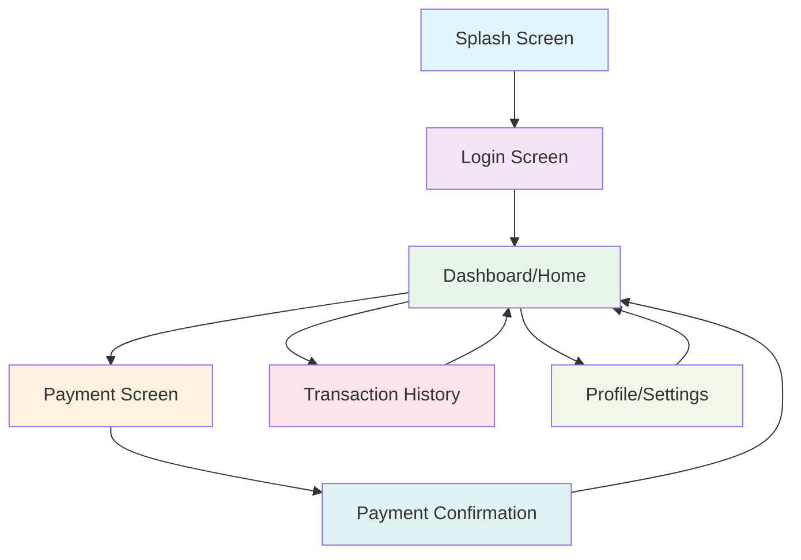

# Design Document: JuPay Mobile Demo

## Overview

The JuPay Mobile Demo is a React-based mobile prototype that simulates a complete payment application experience. The application follows a screen-based architecture with consistent loading states between transitions, implementing the visual design from the provided Figma specifications.

The prototype demonstrates typical payment app workflows including authentication, account management, payment processing, and transaction history - all with realistic loading behaviors that simulate real-world app performance.

## Architecture

### High-Level Architecture

The application follows a component-based React architecture with the following layers:

```
┌─────────────────────────────────────┐
│           Presentation Layer        │
│  (React Components + Mobile UI)     │
├─────────────────────────────────────┤
│           Application Layer         │
│  (State Management + Navigation)    │
├─────────────────────────────────────┤
│            Service Layer            │
│  (Demo Data + Loading Simulation)   │
├─────────────────────────────────────┤
│           Infrastructure            │
│     (React Router + Vite Build)     │
└─────────────────────────────────────┘
```

### Technology Stack

- **Frontend Framework**: React 18 with TypeScript
- **Build Tool**: Vite for fast development and optimized builds
- **Routing**: React Router for screen navigation
- **State Management**: React Context API for global state
- **Styling**: CSS Modules or Styled Components (following Figma design system)
- **Loading States**: Custom hook for 3-second transition delays

### Navigation Flow



## Components and Interfaces

### Core Components

#### 1. Screen Container Component
```typescript
interface ScreenContainerProps {
  children: React.ReactNode;
  title?: string;
  showBackButton?: boolean;
  onBack?: () => void;
}

const ScreenContainer: React.FC<ScreenContainerProps>
```

#### 2. Loading State Component
```typescript
interface LoadingStateProps {
  message?: string;
  duration?: number; // defaults to 3000ms
  onComplete: () => void;
}

const LoadingState: React.FC<LoadingStateProps>
```

#### 3. Navigation Hook
```typescript
interface NavigationHook {
  navigateWithLoading: (path: string, loadingMessage?: string) => void;
  isLoading: boolean;
  currentPath: string;
}

const useNavigationWithLoading: () => NavigationHook
```

### Screen Components

#### 1. Splash Screen
- Displays app logo and branding
- Auto-navigates to login after initial delay
- Implements fade-in animations

#### 2. Login Screen
- Username/password input fields
- Login button with validation
- Demo credentials acceptance
- Forgot password link (demo only)

#### 3. Dashboard Screen
- Account balance display
- Quick action buttons (Send, Receive, Pay Bills)
- Recent transactions preview
- Navigation to other sections

#### 4. Payment Screen
- Recipient selection/input
- Amount input with number pad
- Payment method selection
- Confirmation flow

#### 5. Transaction History Screen
- Scrollable transaction list
- Filter and search capabilities
- Transaction detail views

#### 6. Profile/Settings Screen
- User profile information
- App settings and preferences
- Security options
- Help and support links

### Interface Definitions

```typescript
// Core navigation interface
interface AppNavigation {
  currentScreen: ScreenType;
  navigationHistory: ScreenType[];
  navigateToScreen: (screen: ScreenType) => Promise<void>;
  goBack: () => Promise<void>;
}

// Screen type enumeration
enum ScreenType {
  SPLASH = 'splash',
  LOGIN = 'login',
  DASHBOARD = 'dashboard',
  PAYMENT = 'payment',
  TRANSACTIONS = 'transactions',
  PROFILE = 'profile',
  PAYMENT_CONFIRMATION = 'payment-confirmation'
}

// Loading state management
interface LoadingManager {
  showLoading: (message?: string) => void;
  hideLoading: () => void;
  isLoading: boolean;
  loadingMessage: string;
}
```

## Data Models

### User Model
```typescript
interface User {
  id: string;
  username: string;
  displayName: string;
  email: string;
  phoneNumber: string;
  profileImage?: string;
  accountBalance: number;
  currency: string;
}
```

### Transaction Model
```typescript
interface Transaction {
  id: string;
  type: 'sent' | 'received' | 'bill_payment';
  amount: number;
  currency: string;
  recipient?: string;
  sender?: string;
  description: string;
  timestamp: Date;
  status: 'completed' | 'pending' | 'failed';
  category?: string;
}
```

### Payment Request Model
```typescript
interface PaymentRequest {
  recipient: string;
  amount: number;
  currency: string;
  description?: string;
  paymentMethod: PaymentMethod;
}

interface PaymentMethod {
  id: string;
  type: 'bank_account' | 'card' | 'wallet';
  displayName: string;
  lastFourDigits?: string;
}
```

### App State Model
```typescript
interface AppState {
  user: User | null;
  isAuthenticated: boolean;
  currentScreen: ScreenType;
  isLoading: boolean;
  loadingMessage: string;
  transactions: Transaction[];
  paymentMethods: PaymentMethod[];
}
```

## Correctness Properties

*A property is a characteristic or behavior that should hold true across all valid executions of a system-essentially, a formal statement about what the system should do. Properties serve as the bridge between human-readable specifications and machine-verifiable correctness guarantees.*

Before writing the correctness properties, let me analyze the acceptance criteria for testability:

<function_calls>
<invoke name="prework">
<parameter name="featureName">jupay-mobile-demo

Based on the prework analysis, here are the key correctness properties derived from the requirements:

### Property 1: Mobile Viewport Consistency
*For any* screen size or device type, the app should maintain mobile viewport dimensions and mobile-optimized layout patterns.
**Validates: Requirements 1.2**

### Property 2: Responsive Mobile Design
*For any* mobile screen size within the supported range, the app should adapt layouts appropriately while maintaining usability and visual hierarchy.
**Validates: Requirements 1.3**

### Property 3: Touch Target Accessibility
*For any* interactive element in the app, the touch target should meet minimum size requirements (44px minimum) and have appropriate spacing for mobile interaction.
**Validates: Requirements 1.5**

### Property 4: Loading State Timing
*For any* user action that triggers screen transition, the app should display a loading state for exactly 3 seconds before completing the navigation.
**Validates: Requirements 2.1, 4.3**

### Property 5: Loading State Interaction Blocking
*For any* loading state that is active, user interactions should be prevented or ignored until the loading completes.
**Validates: Requirements 2.2**

### Property 6: Post-Loading Navigation
*For any* completed loading state, the app should transition to the correct target screen as determined by the navigation action.
**Validates: Requirements 2.3**

### Property 7: Visual Consistency
*For any* screen in the app, common UI elements (buttons, loading animations, typography) should use consistent styling and behavior patterns.
**Validates: Requirements 1.4, 2.4**

### Property 8: Loading Visual Feedback
*For any* loading state, visual feedback elements (spinners, progress indicators, or animations) should be present and active.
**Validates: Requirements 2.5**

### Property 9: Navigation Logic
*For any* user action on any screen, the resulting navigation should follow logical flow patterns and lead to appropriate destination screens.
**Validates: Requirements 3.6, 4.1**

### Property 10: Navigation Elements Presence
*For any* screen that supports navigation, appropriate navigation elements (buttons, links, back navigation) should be present and properly labeled.
**Validates: Requirements 4.2**

### Property 11: Navigation History Management
*For any* navigation sequence, the app should maintain proper navigation history to enable correct back navigation behavior.
**Validates: Requirements 4.4**

### Property 12: Navigation Error Handling
*For any* invalid navigation attempt, the app should handle it gracefully without crashing and maintain the current stable state.
**Validates: Requirements 4.5**

### Property 13: Demo Payment Processing
*For any* payment flow execution, the app should complete successfully without making actual financial transactions or external API calls.
**Validates: Requirements 5.1**

### Property 14: Demo Action Success Flows
*For any* demo action performed, the app should display appropriate success or confirmation screens with relevant messaging.
**Validates: Requirements 5.2**

### Property 15: Demo Data Population
*For any* screen that displays data, realistic demo data should be present and properly formatted according to the expected data types.
**Validates: Requirements 5.3**

### Property 16: Form Validation and Feedback
*For any* form submission, the app should validate input appropriately and provide clear feedback for both valid and invalid submissions.
**Validates: Requirements 5.4**

### Property 17: End-to-End User Journey Completion
*For any* complete user journey (login through payment completion), all steps should be executable without errors or broken flows.
**Validates: Requirements 5.5**

## Error Handling

### Loading State Errors
- If loading state fails to complete within expected timeframe, provide fallback navigation
- Handle loading state interruptions gracefully (e.g., component unmounting)
- Provide error boundaries around loading components

### Navigation Errors
- Invalid route handling with fallback to safe screen (dashboard)
- Navigation history corruption recovery
- Deep link handling for unsupported routes

### Form and Input Errors
- Input validation with clear error messaging
- Network simulation errors for demo purposes
- Form state recovery after errors

### Demo Data Errors
- Fallback data when demo data fails to load
- Graceful handling of missing or malformed demo data
- Error states for simulated payment failures

## Testing Strategy

### Dual Testing Approach

The testing strategy employs both unit testing and property-based testing to ensure comprehensive coverage:

**Unit Tests** focus on:
- Specific screen rendering and functionality
- Individual component behavior
- Edge cases and error conditions
- Integration points between components
- Demo data loading and formatting

**Property-Based Tests** focus on:
- Universal properties that hold across all inputs
- Navigation behavior across all screen combinations
- Loading state consistency across all transitions
- Form validation across various input scenarios
- Responsive behavior across different viewport sizes

### Property-Based Testing Configuration

- **Testing Library**: Fast-check for JavaScript/TypeScript property-based testing
- **Test Iterations**: Minimum 100 iterations per property test
- **Test Tagging**: Each property test references its design document property
- **Tag Format**: `// Feature: jupay-mobile-demo, Property {number}: {property_text}`

### Testing Implementation Requirements

1. **Property Test Coverage**: Each correctness property must be implemented by exactly one property-based test
2. **Unit Test Balance**: Focus unit tests on specific examples and edge cases rather than comprehensive input coverage
3. **Integration Testing**: Test complete user flows from splash screen through payment completion
4. **Mobile Testing**: Test responsive behavior and touch interactions
5. **Loading State Testing**: Verify timing, blocking behavior, and visual feedback
6. **Demo Mode Testing**: Ensure all functionality works without external dependencies

### Test Environment Setup

- **Mobile Simulation**: Use viewport simulation for mobile testing
- **Timer Mocking**: Mock timers for loading state testing
- **Navigation Mocking**: Mock React Router for navigation testing
- **Demo Data**: Use consistent test fixtures for demo data scenarios
- **Accessibility Testing**: Verify touch targets and mobile accessibility standards